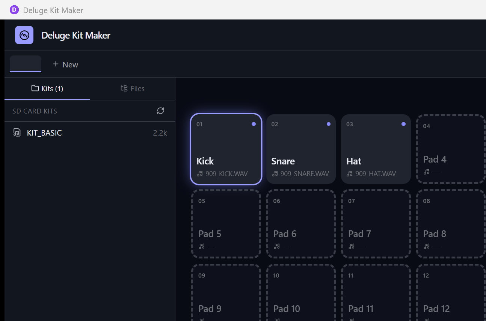

# Deluge Kit Maker

A modern desktop app for building, auditioning, sequencing and saving drum kits for the [Synthstrom Deluge](https://synthstrom.com/product/deluge/).

> **Status:** working proof of concept. Audio engine, sequencer, save/load and drag-drop import all work; expect rough edges in the UI polish layer.



---

## What it does

- **Drop a folder of WAVs** and have them auto-classified into a 16-pad kit (`kicks > snare > clap > rim > hats > toms > ride > crash > perc > fx`) with natural-numeric ordering (`kick_1`, `kick_2`, … `kick_10`).
- **Audition pads** instantly (cpal-driven mixer with a 32-voice pool, sample-accurate scheduling).
- **Edit per-pad params**: waveform with trim handles, volume, pan, pitch (±24 semitones), reverse, play mode.
- **Sequence pads** in a 16-step grid: drag to paint, alt-click (or right-click) for accents, swing knob ±50%. Pattern edits never stop the transport.
- **Save** to the Deluge SD card layout: writes valid v4 `KITS/*.XML` and bundles samples into `KITS/<name>/` (portable) or `SAMPLES/KIT MAKER/<name>/` (shared+dedup'd).
- **File browser** sidebar to drag samples straight off disk; remembers the last directory you used and the last SD card root you opened.
- **Manage multiple kits** in tabs.

## Why

Existing Deluge tooling (kit-maker.com, fyyyyy's kit-generator, deluge-commander, etc.) is conversion-or-CLI-only — you can't *hear* what you're building until you load it on the hardware. This app fills that gap with a native low-latency audio path.

## Compatibility

- **Firmware:** kits target official **v4.x** XML and are designed to also load on community **Chopin (v1.2)**.
- **OS:** Windows 11 (primary). Code is Tauri + Rust, so macOS/Linux ports are a future possibility but not yet tested.
- **Deluge ↔ PC sync:** the Deluge does **not** expose its SD card as USB mass storage — you save into a folder, then move the SD card or use a card reader.

## Build from source

### Prerequisites

| Tool | Version | Notes |
|---|---|---|
| Rust | stable (1.75+) | `rustup default stable` |
| Node.js | 20+ | LTS recommended |
| pnpm | 9+ | `npm i -g pnpm` |
| WebView2 runtime | latest | Pre-installed on Windows 11 |
| (optional) cargo-tauri | 2.x | `cargo install tauri-cli --version "^2.0"` |

### Run in dev mode

```sh
pnpm install
cargo tauri dev
```

First build takes ~2 minutes (compiling Tauri + audio deps). After that, Rust changes incrementally recompile in ~30s and frontend changes hot-reload instantly.

### Build a release installer

```sh
pnpm install
cargo tauri build
```

Produces an `.msi` installer at `src-tauri/target/release/bundle/msi/`.

### Run tests

```sh
cargo test --workspace            # ~25 unit + integration tests
cargo test -p deluge-audio --test live --release -- --ignored   # plays through speakers
```

## Usage

1. **First launch** → click the SD card button in the top-right and pick the root of your Deluge SD card (or a working folder structured the same way). The app remembers this choice for next time.
2. **Open a kit** from the left sidebar, or hit `+ New` for a blank one.
3. **Click a pad** to audition. Click an **empty** pad to open the file picker. **Drag** between pads to swap; hover and click the **X** to clear.
4. **Drop a folder of WAVs** anywhere on the window to auto-classify into a new kit.
5. **Auto-arrange** (button, top-right) re-runs the classifier on the existing pads.
6. **Files tab** in the left sidebar browses disk; drag a `.wav` onto a pad to assign.
7. **Sequencer**: click-drag to paint steps, alt/right-click for accent, slide swing in the transport bar.
8. **Save** (or `Ctrl+S`) writes the kit to `KITS/<name>.XML` on your SD card. Eject the card and load on the Deluge.

### Keyboard shortcuts

| Key | Action |
|---|---|
| `1` `2` `3` `4` / `Q` `W` `E` `R` / `A` `S` `D` `F` / `Z` `X` `C` `V` | Audition pads 1–16 |
| `Space` | Play / stop sequencer |
| `Esc` | Stop all voices |
| `Ctrl+S` | Save active kit |

## Architecture

```
DelugeKitMaker/
├── src/                            Svelte 5 frontend (Tailwind v4)
├── src-tauri/                      Tauri shell: commands, events, AppState
└── crates/
    ├── deluge-xml/                 parse/write kit XML (official v4 + Chopin)
    ├── deluge-audio/               cpal engine, voice mixer, step scheduler
    ├── deluge-fs/                  SD layout, sample copy/bundle, FAT32 sanitizer
    └── deluge-classify/            filename keyword → DrumCategory rules
```

Key design choices:

- **Audio thread owns timing.** The sequencer ticks inside the cpal callback using a sample-frame clock. The UI only learns about step transitions after they fire (via an `engine://step` Tauri event), so JS jitter never affects audio.
- **Pattern updates are atomic.** Editing a step from the UI sends an `AudioCommand::SetPattern` which the audio thread swaps in via `arc_swap::ArcSwap` on the next buffer boundary — no torn reads, no audio glitches, and the `playing` state is preserved across edits.
- **Sample cache is content-addressed.** `decode_sample` dedups by absolute path; samples are `Arc<DecodedSample>` so handing one to the audio thread is a refcount bump.
- **Save is atomic + dedup'd.** Sample copies use temp+rename; if a bundled sample already exists with the same SHA-1, we reuse it instead of writing a `_1` suffix.

See [the implementation plan](.claude/plans/i-want-to-make-ticklish-twilight.md) (if cloned with `.claude/` present) for the full design write-up.

## Roadmap

The POC works end-to-end. Things on the wishlist:

- Real-hardware confirmation: load a saved kit on a Deluge running official v4.x and community Chopin v1.2. *(Not done — needs a physical device.)*
- Layout polish: right detail panel + sequencer fit on smaller windows without cropping.
- MIDI export of sequencer patterns (via `midly`).
- Synth presets (`SYNTHS/`) — same pipeline, different root element.
- Symphonia + rubato to handle non-44.1kHz / float WAVs without pitch shift.
- Audio settings panel (device picker, buffer size, underrun counter).
- Auto-save backups to `%APPDATA%/DelugeKitMaker/autosave/`.

## License

[MIT](LICENSE) © 2026 Chris Goggins.

## Acknowledgements

- [Synthstrom Audible](https://synthstrom.com) for the Deluge.
- [fyyyyy/deluge-kit-generator](https://github.com/fyyyyy/deluge-kit-generator) — the most useful public reference for the kit XML schema.
- [DelugeFirmware](https://github.com/SynthstromAudible/DelugeFirmware) — source of truth for any ambiguous field.
- [community-maintained XML spec](https://docs.google.com/document/d/11DUuuE1LBYOVlluPA9McT1_dT4AofZ5jnUD5eHvj7Vs) — prose notes that bridged the gap.
